# Mermaid Diagram Reference

This reference covers Mermaid diagram syntax and usage in Docusaurus.

## Setup

### Installation

```bash
npm install @docusaurus/theme-mermaid
```

### Configuration

```typescript
// docusaurus.config.ts
themes: [
  [
    require.resolve('@docusaurus/theme-mermaid'),
    {
      theme: {
        light: 'default',
        dark: 'dark',
      },
    },
  ],
];

markdown: {
  mermaid: true,
};
```

## Diagram Types

### Flowchart

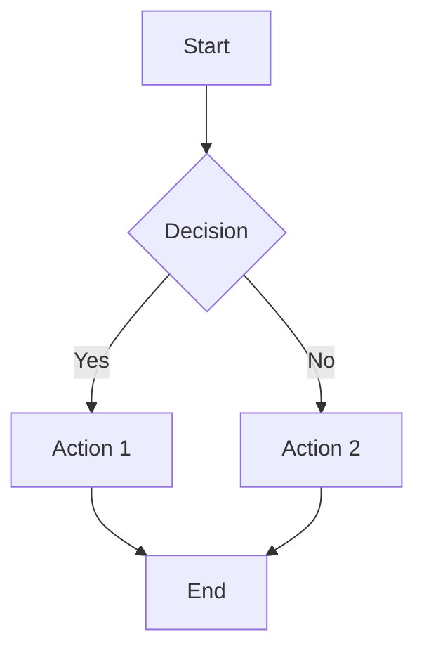

**Directions:**
- `TD` / `TB` - Top to Bottom
- `LR` - Left to Right
- `RL` - Right to Left

### Sequence Diagram

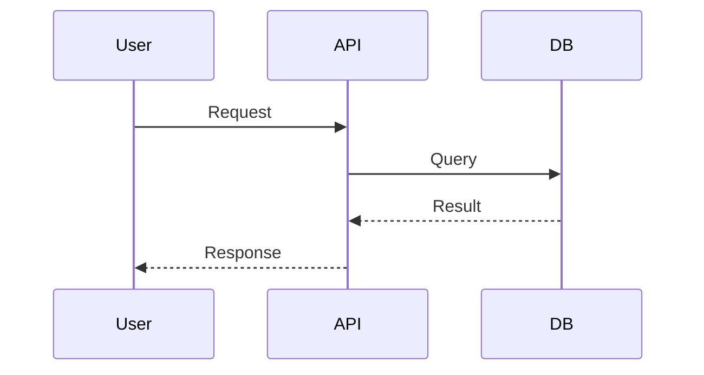

### Class Diagram

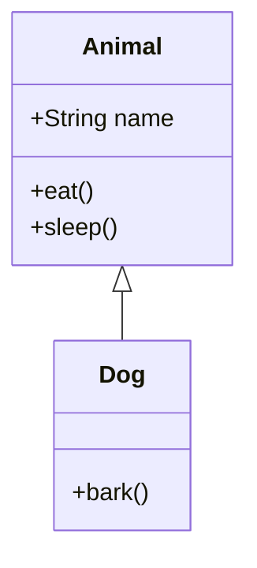

### State Diagram

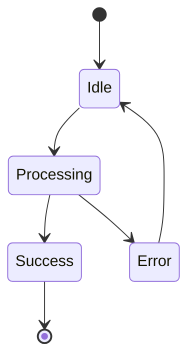

### Entity Relationship

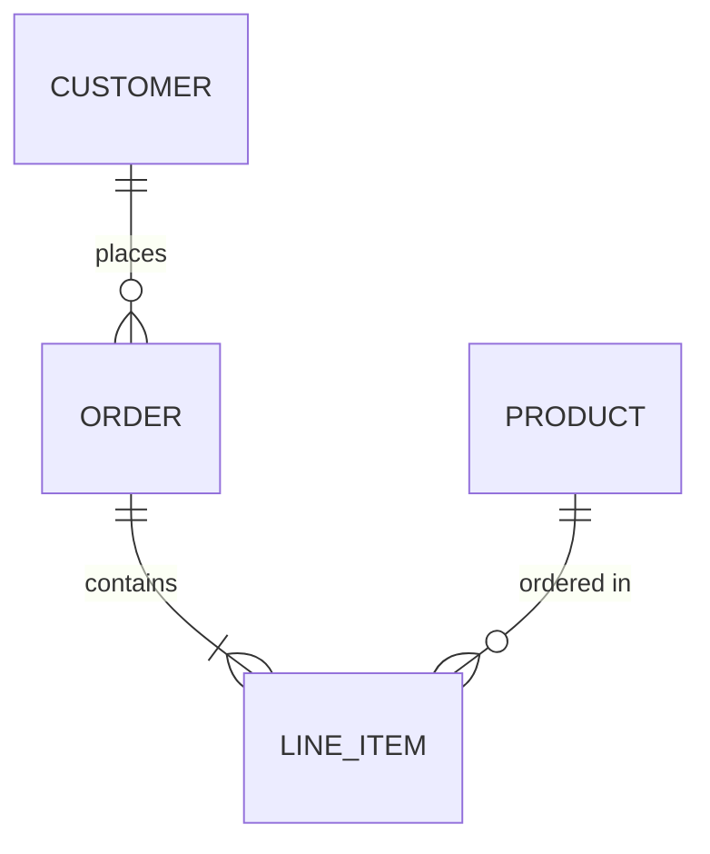

### User Journey

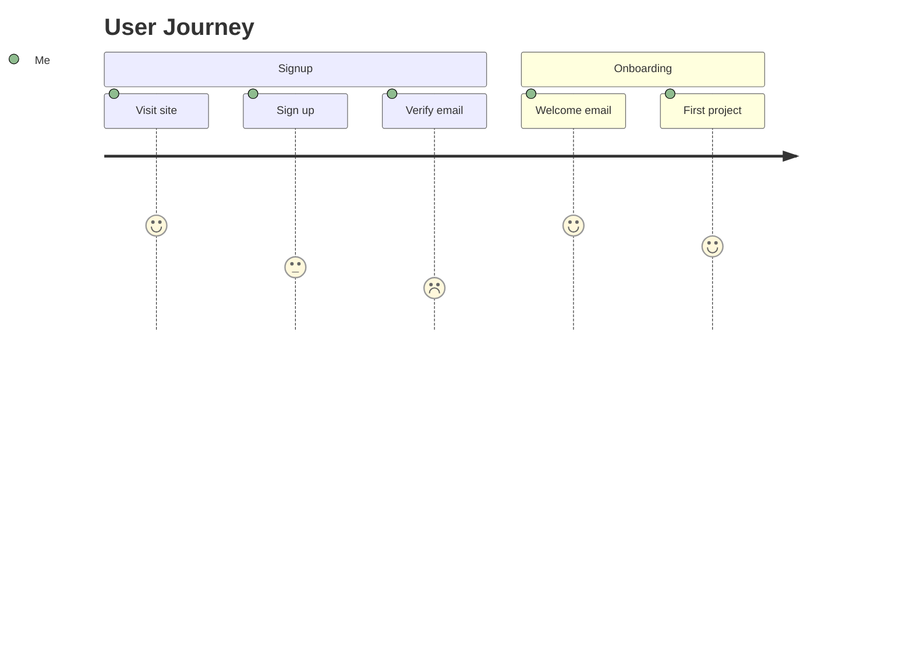

### Gantt Chart

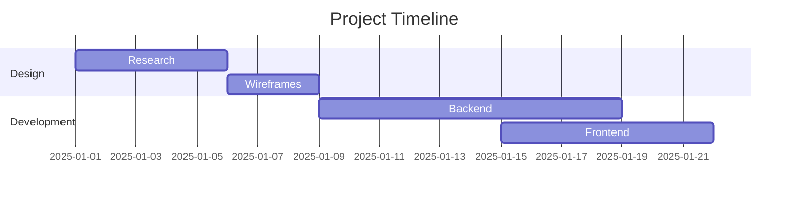

### Pie Chart

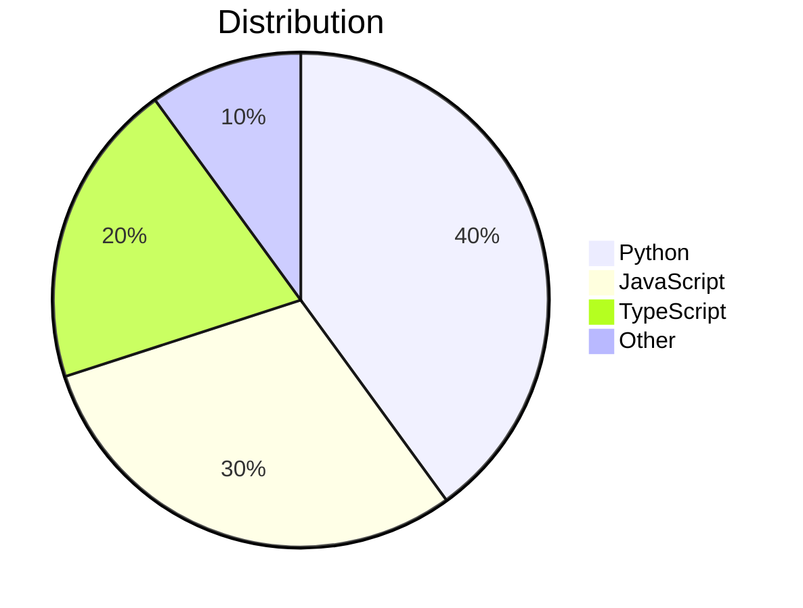

### Mindmap

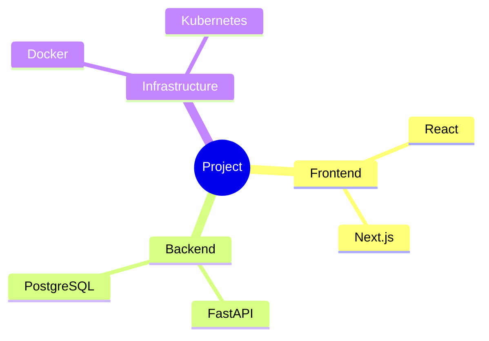

## Styling

### Themes

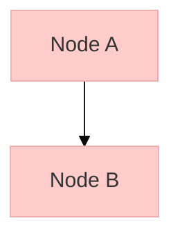

### Custom Classes

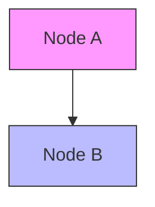

## Syntax Reference

### Nodes

```
[Square]
(Rounded)
[(Stadium)]
{Cylinder}
[/Parallelogram/]
[[Subroutine]]
[(Database)]
[/Trapezoid\]
```

### Connections

```
-->    Arrow
---    Line
-.->   Dotted
===>   Thick
```

### Text

```
Node[Label]           # Center label
Node[Line\nBreak]     # Multi-line
Node["Special <chars>"]  # Escape special chars
```

## Best Practices

1. **Keep it simple** - Complex diagrams are hard to read
2. **Use consistent styling** - Same colors for similar elements
3. **Add titles** - Describe what the diagram shows
4. **Test in editor** - Use mermaid.live to preview
5. **Limit size** - Large diagrams may break on mobile

## Troubleshooting

**Problem:** Diagram not rendering

**Solutions:**
- Verify `@docusaurus/theme-mermaid` is installed
- Check `markdown.mermaid: true` in config
- Look for syntax errors in diagram code

**Problem:** Diagram overflow

**Solutions:**
- Simplify complex diagrams
- Break into multiple diagrams
- Use CSS to control overflow
