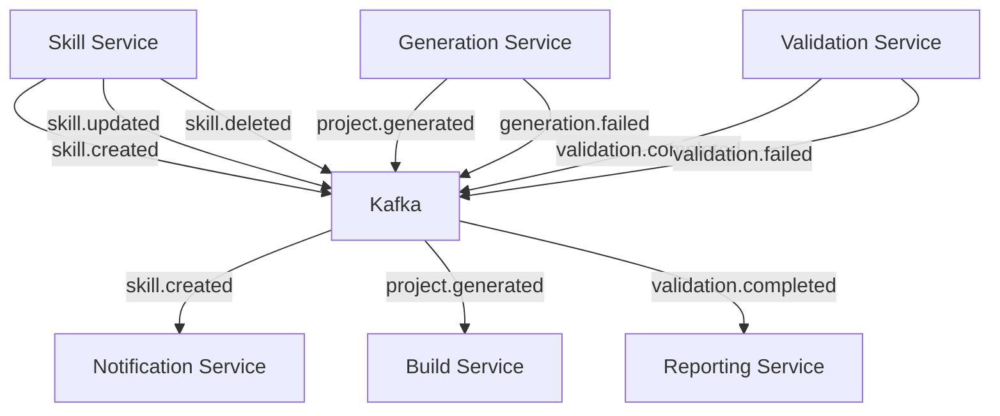
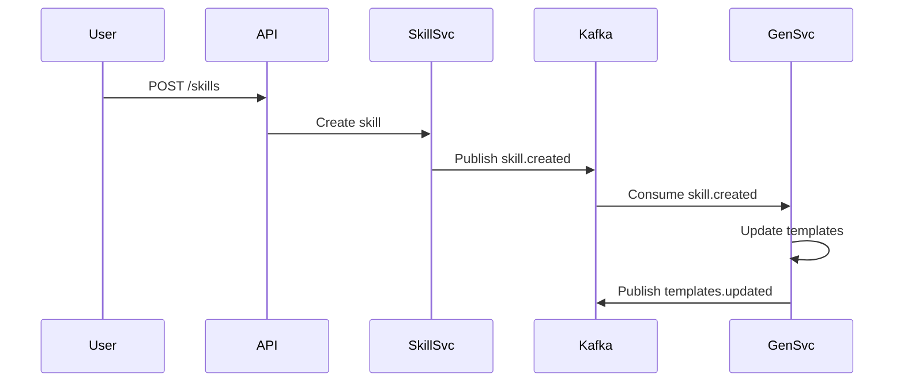
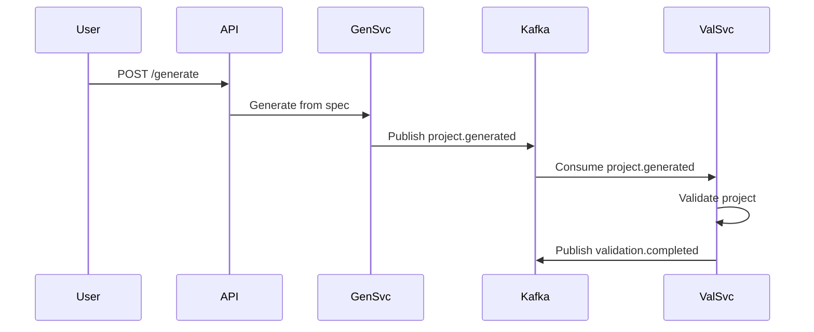

import Mermaid from '@theme/Mermaid';

# Event Flow

The platform uses event-driven architecture for loose coupling between services.

## Kafka Topics



## Event Schemas

### skill.created

```json title="skill.created event schema"
{
  "event_id": "uuid",
  "event_type": "skill.created",
  "timestamp": "2025-01-27T10:00:00Z",
  "data": {
    "skill_id": "string",
    "name": "string",
    "description": "string",
    "version": "string",
    "created_by": "string"
  }
}
```

### project.generated

```json title="project.generated event schema"
{
  "event_id": "uuid",
  "event_type": "project.generated",
  "timestamp": "2025-01-27T10:00:00Z",
  "data": {
    "project_id": "string",
    "skill_id": "string",
    "spec_id": "string",
    "output_path": "string",
    "files_count": "number"
  }
}
```

### validation.completed

```json title="validation.completed event schema"
{
  "event_id": "uuid",
  "event_type": "validation.completed",
  "timestamp": "2025-01-27T10:00:00Z",
  "data": {
    "validation_id": "string",
    "project_id": "string",
    "status": "passed|failed",
    "tests_passed": "number",
    "tests_failed": "number",
    "coverage_percent": "number"
  }
}
```

## Event Flow Examples

### Creating a New Skill



### Generating a Project



## Next Steps

- [API Documentation](../api/rest.md) - REST API details
- [Technology Choices](./technology.md) - Why we chose these technologies
