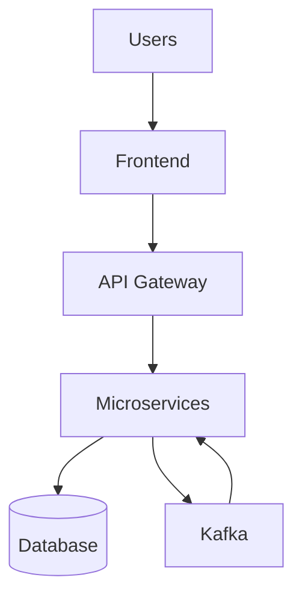

import Mermaid from '@theme/Mermaid';

# Welcome to {{SITE_NAME}}

This is the official documentation for {{SITE_NAME}}.

## Quick Overview

{{SITE_TAGLINE}}

## What You'll Learn

This documentation covers:

- **Getting Started** - Installation, setup, and quick start guide
- **Skills Library** - Overview of available skills and development guides
- **Architecture** - System design, microservices, and event flow
- **API Documentation** - REST APIs, Kafka topics, and WebSocket events
- **Deployment** - Kubernetes, cloud deployment, and CI/CD setup
- **LearnFlow Platform** - User, teacher, and student guides

## Architecture Overview

## Getting Started

To get started with {{SITE_NAME}}, check out the [Installation](./getting-started/installation.md) guide.
