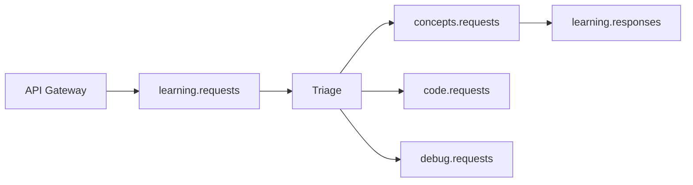

# FastAPI Dapr Agent - Reference

Complete reference for building FastAPI microservices with Dapr integration.

## Dapr Patterns

### Pub/Sub Pattern

Services publish and subscribe to topics asynchronously.

**Publisher:**
```python
from dapr.clients import DaprClient

def publish_event(topic: str, data: dict):
    with DaprClient() as dapr:
        dapr.publish_event(
            pubsub_name="kafka",
            topic_name=topic,
            data=data,
            publish_metadata={"raw_payload": "true"}
        )
```

**Subscriber:**
```python
from dapr.ext.fastapi import DaprApp

dapr_app = DaprApp()

@dapr_app.subscribe(pubsub_name="kafka", topic="learning.requests")
async def handle_request(event_data: dict):
    # Process event
    result = process(event_data)

    # Publish response
    publish_event("learning.responses", result)
```

### State Management Pattern

Store and retrieve state without direct database access.

```python
from dapr.clients import DaprClient

# Save state
def save_progress(user_id: str, progress: dict):
    with DaprClient() as dapr:
        dapr.save_state(
            store_name="statestore",
            key=f"progress_{user_id}",
            value=progress
        )

# Get state
def get_progress(user_id: str):
    with DaprClient() as dapr:
        state = dapr.get_state(
            store_name="statestore",
            key=f"progress_{user_id}"
        )
        return state.json()
```

### Service Invocation Pattern

Call other services synchronously.

```python
from dapr.clients import DaprClient

def call_concepts_service(query: str):
    with DaprClient() as dapr:
        response = dapr.invoke_method(
            id="concepts-service",
            method_name="explain",
            data={"query": query},
            http_verb="POST"
        )
        return response.json()
```

## Kubernetes Deployment

### Sidecar Injection

Dapr sidecar is injected via annotations:

```yaml
annotations:
  dapr.io/enabled: "true"
  dapr.io/app-id: "my-service"
  dapr.io/app-port: "8000"
  dapr.io/config: "dapr-config"
```

### Dapr Configuration

Create a Dapr configuration:

```yaml
apiVersion: dapr.io/v1alpha1
kind: Configuration
metadata:
  name: dapr-config
spec:
  tracing:
    samplingRate: "1"
  features:
  - name: proxy
    enabled: true
```

Apply: `kubectl apply -f dapr.yaml`

## Service Templates

### Triage Service

Routes queries to specialist agents.

```python
@dapr_app.subscribe(pubsub_name="kafka", topic="learning.requests")
async def triage_request(event_data: dict):
    query = event_data.get("query", "")
    query_type = classify_query(query)

    # Route to appropriate topic
    topic_map = {
        "concept": "concepts.requests",
        "code": "code-review.requests",
        "error": "debug.requests"
    }

    target_topic = topic_map.get(query_type, "concepts.requests")
    publish_event(target_topic, event_data)
```

### Concepts Service

Explains Python concepts with AI.

```python
import openai

@dapr_app.subscribe(pubsub_name="kafka", topic="concepts.requests")
async def explain_concept(event_data: dict):
    query = event_data["query"]
    level = event_data.get("level", "beginner")

    # Call OpenAI
    response = openai.ChatCompletion.create(
        model="gpt-4",
        messages=[{
            "role": "system",
            "content": f"Explain Python at {level} level"
        }, {
            "role": "user",
            "content": query
        }]
    )

    # Publish response
    publish_event("learning.responses", {
        "query": query,
        "explanation": response.choices[0].message.content
    })
```

## LearnFlow Services

### Service Dependencies

| Service | Subscribes To | Publishes To |
|---------|--------------|--------------|
| triage | learning.requests | concepts.requests, code-review.requests, debug.requests |
| concepts | concepts.requests | learning.responses |
| code-review | code.submissions | learning.responses |
| debug | debug.requests | learning.responses |
| exercise | exercise.requests | exercise.generated |
| progress | (all events) | (none - state updates) |

### Inter-Service Communication



## Troubleshooting

### Sidecar Not Starting

Check Dapr logs:
```bash
kubectl logs -l app=my-service -c daprd -n default
```

### Pub/Sub Not Working

Verify Dapr components:
```bash
kubectl get components -n default
```

Expected output should include `kafka` pubsub component.

### State Not Persisting

Check state store component:
```bash
kubectl get component statestore -o yaml
```

## Monitoring

### Dapr Metrics

Dapr exposes Prometheus metrics on port 9090.

```yaml
# Add to service
- name: daprd
  ports:
  - containerPort: 9090
    name: metrics
```

### Health Checks

```python
@app.get("/health/dapr")
async def dapr_health():
    with DaprClient() as dapr:
        metadata = dapr.get_metadata()
        return {"status": "healthy", "runtime": metadata}
```
