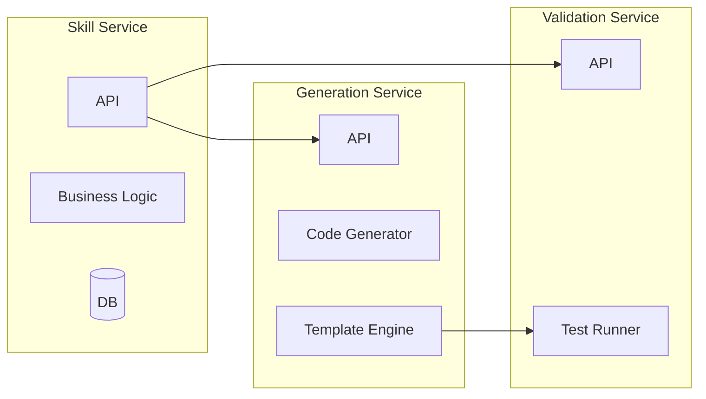

import Mermaid from '@theme/Mermaid';

# Microservices Architecture

The platform uses a microservices architecture for scalability and maintainability.

## Service Boundaries



## Services

### 1. Skill Service

**Responsibilities:**
- Manage skills library
- Store and retrieve skill definitions
- Handle skill versioning

**APIs:**
- `GET /skills` - List all skills
- `GET /skills/:id` - Get skill details
- `POST /skills` - Create new skill
- `PUT /skills/:id` - Update skill

### 2. Generation Service

**Responsibilities:**
- Generate code from specifications
- Apply templates
- Build project structure

**APIs:**
- `POST /generate/project` - Generate project
- `POST /generate/feature` - Generate feature
- `GET /templates` - List templates

### 3. Validation Service

**Responsibilities:**
- Validate generated code
- Run linters and formatters
- Execute tests

**APIs:**
- `POST /validate/code` - Validate code
- `POST /validate/tests` - Run tests
- `GET /validate/report` - Get validation report

## Communication

### Synchronous Communication

Services communicate via REST APIs for request/response patterns:

```python
# Example: Calling another service
response = requests.post(
    'http://generation-service/generate/project',
    json={'spec': spec_data}
)
```

### Asynchronous Communication

Services use Kafka for event-driven communication:

```python
# Example: Publishing events
producer.send('skill.created', {
    'skill_id': skill.id,
    'name': skill.name,
    'timestamp': datetime.now().isoformat()
})
```

## Data Ownership

Each service owns its data:

| Service | Data Store | Owned Data |
|---------|-----------|-----------|
| Skill Service | PostgreSQL | Skills, versions |
| Generation Service | File System | Generated projects |
| Validation Service | PostgreSQL | Validation reports |

## Next Steps

- [Event Flow](./event-flow.md) - How events flow through the system
- [Technology Choices](./technology.md) - Why we chose these technologies
