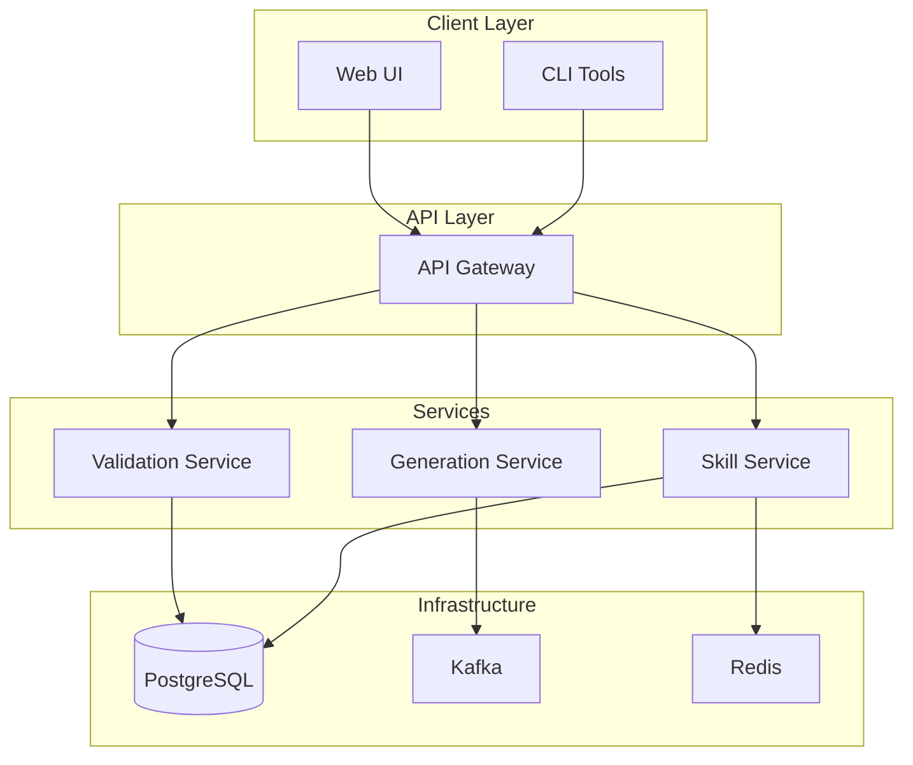

import Mermaid from '@theme/Mermaid';

# System Overview

{{SITE_NAME}} is a cloud-native platform for AI-powered skills development and deployment.

## Architecture Diagram

## Key Components

### Client Layer
- **CLI Tools**: Command-line interface for developers
- **Web UI**: Browser-based interface for users

### API Layer
- **API Gateway**: Routes requests to appropriate services
- **Authentication**: JWT-based authentication
- **Rate Limiting**: Prevents abuse

### Services
- **Skill Service**: Manages skills library
- **Generation Service**: Generates code from specs
- **Validation Service**: Validates generated code

### Infrastructure
- **PostgreSQL**: Primary database
- **Kafka**: Event streaming
- **Redis**: Caching and sessions

## Technology Stack

| Component | Technology |
|-----------|-----------|
| Frontend | Next.js, React, TypeScript |
| Backend | FastAPI, Python |
| Database | PostgreSQL |
| Messaging | Kafka |
| Caching | Redis |
| Container | Docker, Kubernetes |

## Next Steps

- [Microservices](./microservices.md) - Detailed microservices architecture
- [Event Flow](./event-flow.md) - How events flow through the system
- [Technology Choices](./technology.md) - Why we chose these technologies
