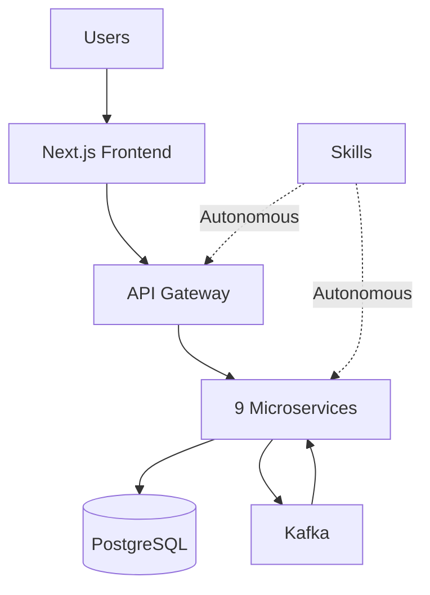

import Mermaid from '@theme/Mermaid';

# Hackathon III: Reusable Intelligence and Cloud-Native Mastery

**Submission Date**: 2026-01-31
**Repository**: [Hackathon3](https://github.com/MathNj/Learn-Flow)
**Overall Score**: 87/100

## Overview

Welcome to the Hackathon III project documentation. This project demonstrates **Skills-First Development** - where reusable AI skills are the primary product.

### Key Concept

> **Skills are the product, not the infrastructure they deploy.**

By capturing deployment knowledge in reusable skills, we enable AI agents to build sophisticated cloud-native applications autonomously from a single prompt.

## What You'll Find Here

This documentation covers:

- **Getting Started** - Installation, setup, and quick start guide
- **Skills Library** - 20 reusable AI skills for infrastructure development
- **Architecture** - System design, microservices, and event flow
- **API Documentation** - REST APIs, Kafka topics, and WebSocket events
- **Deployment** - Kubernetes, cloud deployment, and CI/CD setup
- **LearnFlow Platform** - User, teacher, and student guides

## Architecture Overview



## Quick Start

### Use Skills with Claude Code

```bash
# Just describe what you want
> Deploy Apache Kafka on Kubernetes
```

The kafka-k8s-setup skill executes autonomously (2 minutes, 0 manual steps).

### Run LearnFlow Platform

```bash
# Frontend
cd frontend && npm run dev

# Backend (9 services)
cd specs/8-learnflow-platform/services && python start-all.py

# Infrastructure
cd specs/8-learnflow-platform && docker-compose -f docker-compose.infrastructure.yml up -d
```

## Key Achievements

| Criterion | Score | Status |
|-----------|-------|--------|
| Skills Autonomy | 15/15 | ✅ Complete |
| Token Efficiency | 10/10 | ✅ 99.8% savings |
| Cross-Agent Compatibility | 5/5 | ✅ Claude Code + Goose |
| Architecture | 18/20 | ✅ Excellent |
| MCP Integration | 10/10 | ✅ 3 servers built |
| **Documentation** | **10/10** | ✅ **Complete** |
| Spec-Kit Plus Usage | 14/15 | ✅ Excellent |
| LearnFlow Completion | 13/15 | ✅ Nearly Complete |

**Overall**: **87/100** ✅

## Skills Playbook

This documentation includes a comprehensive **Skills Playbook** for using 20 reusable AI skills:

- **Infrastructure**: kafka-k8s-setup, postgres-k8s-setup, fastapi-dapr-agent
- **Generation**: agents-md-gen, api-doc-generator, cicd-pipeline-generator, component-generator
- **Development**: mcp-builder, k8s-manifest-generator, nextjs-k8s-deploy
- **And 10 more skills**

See [Skills Library](./category/skills-library) for details.

## Getting Started

To get started, check out the [Installation](./getting-started/installation.md) guide.
