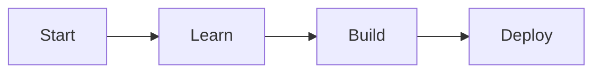
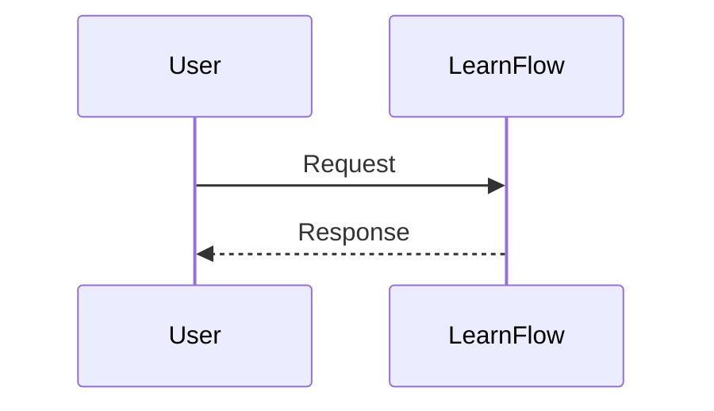

# Quick Start Guide: Docusaurus Documentation Deployment

**Feature**: Docusaurus Documentation Deployment for LearnFlow
**Date**: 2026-01-28
**Prerequisites**: Node.js 20+, npm 10+, Git

---

## 5-Minute Setup

This guide will get you up and running with a Docusaurus documentation site in under 5 minutes.

### Step 1: Initialize Project (1 minute)

```bash
# Create new directory
mkdir learnflow-docs && cd learnflow-docs

# Initialize Docusaurus with TypeScript
npx create-docusaurus@latest . --typescript
```

Select the following options when prompted:
- **Website or Blog?**: `website`
- **Use TypeScript?**: `Yes`
- **Package Manager?**: `npm` (or your preference)

### Step 2: Install Dependencies (1 minute)

```bash
npm install
```

### Step 3: Start Development Server (30 seconds)

```bash
npm run start
```

Open http://localhost:3000 in your browser. You should see the default Docusaurus welcome page.

### Step 4: Configure Mermaid Diagrams (30 seconds)

Add to `docusaurus.config.ts`:

```typescript
export default {
  // ... existing config
  themes: ['@docusaurus/theme-mermaid'],
  markdown: {
    mermaid: true,
  },
};
```

Install the theme:

```bash
npm install @docusaurus/theme-mermaid
```

### Step 5: Add Your First Documentation Page (1 minute)

Create `docs/getting-started.md`:

```markdown
---
id: getting-started
title: Getting Started
description: Welcome to LearnFlow documentation
---

## Welcome

This is your first documentation page with **Mermaid diagram support**:


```

### Step 6: Build Your Site (1 minute)

```bash
npm run build
```

The static site will be generated in the `build/` directory.

---

## Configuration Templates

### Minimal Configuration

For quick setup, use this minimal `docusaurus.config.ts`:

```typescript
import { themes } from 'prism-react-renderer';

export default {
  title: 'LearnFlow Docs',
  url: 'https://your-domain.com',
  baseUrl: '/',

  presets: [
    [
      '@docusaurus/preset-classic',
      {
        docs: {
          sidebarPath: './sidebars.ts',
        },
      },
    ],
  ],

  themes: ['@docusaurus/theme-mermaid'],

  markdown: {
    mermaid: true,
  },

  themeConfig: {
    navbar: {
      items: [
        { type: 'docSidebar', sidebarId: 'docsSidebar', label: 'Docs' },
      ],
    },
    prism: {
      theme: themes.github,
      darkTheme: themes.dracula,
    },
  },

  onBrokenLinks: 'throw',
};
```

### Sidebar Configuration

Create `sidebars.ts`:

```typescript
import type { SidebarsConfig } from '@docusaurus/plugin-content-docs';

const sidebars: SidebarsConfig = {
  docsSidebar: [
    'getting-started',
    {
      type: 'category',
      label: 'Guides',
      items: ['guide1', 'guide2'],
    },
  ],
};

export default sidebars;
```

---

## Search Setup

### Algolia DocSearch (Recommended)

1. Apply for DocSearch at https://docsearch.algolia.com/apply
2. Once approved, add to `docusaurus.config.ts`:

```typescript
themeConfig: {
  algolia: {
    appId: 'YOUR_APP_ID',
    apiKey: 'YOUR_SEARCH_API_KEY',
    indexName: 'learnflow',
  },
}
```

### Built-in Search (Fallback)

Install plugin:

```bash
npm install @easyops-cn/docusaurus-search-local
```

Add to `docusaurus.config.ts`:

```typescript
themes: [
  [
    '@easyops-cn/docusaurus-search-local',
    {
      hashed: true,
      language: ['en'],
    },
  ],
]
```

---

## Deployment

### GitHub Pages (Recommended)

1. Create `.github/workflows/deploy.yml`:

```yaml
name: Deploy to GitHub Pages

on:
  push:
    branches: [main]

permissions:
  contents: read
  pages: write
  id-token: write

jobs:
  deploy:
    runs-on: ubuntu-latest
    steps:
      - uses: actions/checkout@v4
      - uses: actions/setup-node@v4
        with:
          node-version: 20
          cache: 'npm'
      - run: npm ci
      - run: npm run build
      - uses: actions/configure-pages@v4
      - uses: actions/upload-pages-artifact@v3
        with:
          path: ./build
      - uses: actions/deploy-pages@v4
```

2. Enable GitHub Pages in repository settings:
   - Go to Settings → Pages
   - Source: GitHub Actions

### Netlify Alternative

1. Create `netlify.toml`:

```toml
[build]
  command = "npm run build"
  publish = "build"

[build.environment]
  NODE_VERSION = "20"
```

2. Connect your repository to Netlify

### Vercel Alternative

1. Create `vercel.json`:

```json
{
  "buildCommand": "npm run build",
  "outputDirectory": "build",
  "framework": "create-react-app"
}
```

2. Import your project in Vercel dashboard

---

## Content Authoring Tips

### Code Syntax Highlighting

Use fenced code blocks with language identifier:

````markdown
```python
def hello():
    print("Hello, LearnFlow!")
```
````

### Mermaid Diagrams

```markdown

```

### Internal Links

```markdown
[Link text](./other-page)
```

### External Links

```markdown
[Link text](https://example.com)
```

### Images

```markdown

```

---

## Common Commands

| Command | Description |
|---------|-------------|
| `npm run start` | Start development server |
| `npm run build` | Build for production |
| `npm run serve` | Preview production build |
| `npm run deploy` | Deploy to GitHub Pages (if configured) |
| `npm run swizzle` | Customize Docusaurus components |

---

## Troubleshooting

### Port Already in Use

If port 3000 is occupied:

```bash
npm run start -- --port 3001
```

### Build Fails with Broken Links

To see warnings instead of errors during development:

```typescript
// docusaurus.config.ts
onBrokenLinks: 'warn',
```

### Mermaid Diagrams Not Rendering

Ensure you have:
1. Installed `@docusaurus/theme-mermaid`
2. Added it to `themes` array
3. Set `markdown.mermaid: true`

### Search Not Working

For Algolia: Verify your credentials are correct and the index has been populated.

For built-in search: Ensure the plugin is added to `themes` (not `plugins`).

---

## Next Steps

1. **Customize branding**: Update `title`, `tagline`, add logo in `themeConfig`
2. **Configure navigation**: Add navbar items and sidebar categories
3. **Set up deployment**: Configure GitHub Actions, Netlify, or Vercel
4. **Apply for DocSearch**: Get free Algolia search for your docs
5. **Customize styling**: Edit `src/css/custom.css`

---

## Useful Resources

- [Official Docusaurus Docs](https://docusaurus.io/docs)
- [Docusaurus GitHub](https://github.com/facebook/docusaurus)
- [Mermaid Documentation](https://mermaid-js.org/)
- [Algolia DocSearch](https://docsearch.algolia.com/)
